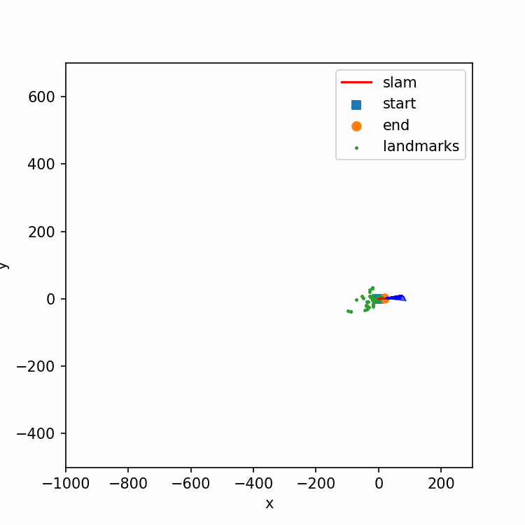
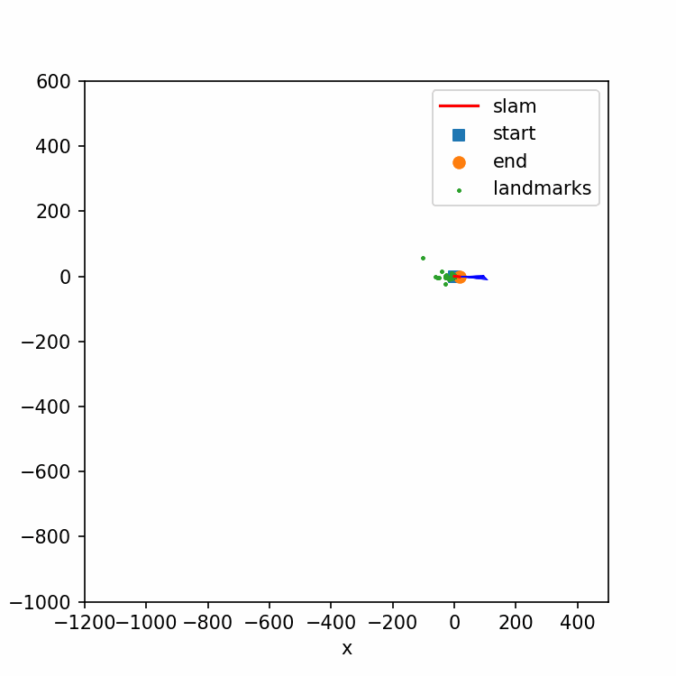

# ECE-276A-Project3
## Visual-Inertial SLAM
This is the project 3 of the course UCSD ECE276A: Sensing & Estimation in Robotics.

Implement visual-inertial simultaneous localization and mapping (SLAM) using an extended Kalman filter (EKF).

## Usage:
### Install package:
    pip3 install -r requirement.txt
### Run code:
    python3 main.py -d [dataset] --r [reduce factor for visual features] --w [w noise scale] --v [v noise scale]
### Example:
    python3 main.py --d 03 --r 4 --w 10e-6 --v 100
    python3 main.py --d 10 --r 4 --w 10e-6 --v 100

### Source code description:
under *.code/*
- [main.py](./code/main.py): Main function.
- [mapping.py](./code/mapping.py): Functions for landmark mapping.
- [motion.py](./code/motion.py): Functions for motion model.
- [observation.py](./code/observation.py): Functions for observation model.
- [pr3_utils.py](./code/pr3_utils.py): Functions provided for some transformation.
- [slam.ipynb](./code/slam.ipynb): For testing and debugging. **View the intermediate output of slam here!**
- [utils.py.py](./code/utils.py): Functions for transformation and others.
- [visual_slam.py](./code/visual_slam.py): Functions for visual inertial slam.
- [visualization.py](./code/visualization.py): Functions for visualizing the trajectory and landmark mapping.

## SLAM results
dataset 03             |  dataset 10
:-------------------------:|:-------------------------:
  |  

*raw data can be found in [./data](./data)*